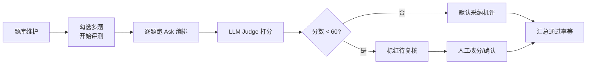

# Ask 编排效果评测（题库 + 机评 + 人工复核）技术方案

> 状态：第 1 期进行中——题库 / 测评任务表与页面 CRUD 已落地；「开始测评」暂为状态占位，Ask + Judge 实跑待接入。  
> 代码位置：模型 `app/models/eval_models.py`；服务 `app/services/evals.py`；接口 `/api/evals/*`；前端 `front/src/pages/Eval/`。  
> 定位：针对固定节点编排（`rewrite → retrieve → answer`）做**回答效果评测列表**，不以 Tracing / ReAct Tool 调用链为主。  
> 依赖现有能力：LangGraph Ask、`ask_logs`、DeepSeek 客户端、知识库 `documents` / hits。

## 1. 背景与目标

现有智能检索问答已具备完整链路与异常收尾（取消、超时、断连兜底、回答依据等），工程稳定性可演示。交付与打磨重点转向：**用可复现的题集衡量编排「准不准」**。

本方案目标：

1. 人工维护评测用例（问题 + 期望）
2. 勾选多题发起一场评测，复用现有 Ask 编排生成实际结果
3. LLM-as-Judge 自动打分；分数 &lt; 60 标为待复核
4. 人工可按需改分；列表与详情反馈通过率 / 命中率 / 均分
5. 历史场次不受题库日后修改影响（开跑快照）

**明确不做（本期）**：LangSmith 等 Tracing 平台作为主路径；ReAct / Tool Calling 检测。

## 2. 为何不用 Tracing 做主方案

| 诉求 | Tracing（如 LangSmith） | 本方案 |
|------|-------------------------|--------|
| 看节点是否跑通、卡在哪 | 擅长 | 次要（已有 SSE + `ask_logs`） |
| 固定题集上的回答准不准 | 弱 | **主目标** |
| 期望 vs 实际对照、打分、低分复核 | 需另接 Eval | **产品闭环** |
| 数据留在自有库、可演示 | 依赖外部 | SQLite/自有表 |

编排是**线性固定节点**，不是工具循环 Agent；效果评测应落在「题 → 跑 → 分 → 复核」列表，而不是调用瀑布图。

## 3. 业务流程



页面闭环：

1. **题库页**：新增 / 查询 / 编辑 / 删除用例（问题 + 期望文档 + 期望要点）
2. **测评页**：新建一场测试，勾选多道题 → 生成 `eval_run` → 系统跑题并机评
3. **运行详情**：每行展示问题 + 期望 + 结果 + 机评分；&lt;60 高亮；提供人工打分入口

## 4. 数据模型

### 4.1 三张表职责（考试类比）

| 表 | 类比 | 作用 |
|----|------|------|
| `eval_cases` | 题库 | 可反复使用的标准题（问题 + 期望） |
| `eval_runs` | 一场考试 | 某次点击「开始评测」的任务与汇总指标 |
| `eval_run_items` | 答卷明细 | 该场每题的快照、实际结果、机评/人评分 |

关系：题库题目被勾选进入一场评测；开跑时**拷贝**题目内容到 item 快照列，并写入 Ask 结果与分数。

### 4.2 `eval_cases`（题库）

| 字段 | 说明 |
|------|------|
| `id` | 主键 |
| `query` | 用户问题 |
| `expected_doc` | 期望命中文档（如 `source_path` / 标题，可多值 JSON） |
| `expected_points` | 期望要点 / 关键词（文本） |
| `enabled` | 是否可被勾选参赛 |
| `created_at` / `updated_at` | 时间 |

题库**允许修改**。修改只影响**之后新开的评测**；已结束场次看快照。

### 4.3 `eval_runs`（一场评测）

| 字段 | 说明 |
|------|------|
| `id` | 主键 |
| `name` / `remark` | 名称或备注 |
| `status` | `pending` / `running` / `done` / `failed` |
| `model` | 当时模型名（快照配置） |
| `config_json` | 可选：top_k、hybrid 等配置快照 |
| `total` / `passed` / `needs_review` / `error_count` | 汇总 |
| `avg_score` | 平均最终分 |
| `created_at` / `finished_at` | 时间 |
| `created_by` | 可选用户 id |

### 4.4 `eval_run_items`（答卷 + 快照）

| 字段 | 说明 |
|------|------|
| `id` | 主键 |
| `run_id` | 所属场次 |
| `case_id` | **可选追溯**：来自哪道题库题；**不用于展示正文** |
| `query_snapshot` | 开考时问题复印件 |
| `expected_doc_snapshot` | 开考时期望文档复印件 |
| `expected_points_snapshot` | 开考时期望要点复印件 |
| `optimized_query` | Ask 实际优化问句 |
| `hits_json` | 实际检索 hits |
| `answer` | 实际回答 |
| `ask_status` | success / error / … |
| `duration_ms` | 该题耗时 |
| `rewrite_fallback` | 是否改写降级 |
| `auto_score` | 机评 0–100 |
| `auto_reason` | 机评理由 |
| `needs_review` | `auto_score < 60` 或机评失败时为 true |
| `human_score` | 人工分，可空 |
| `final_score` | 有人工则用人工，否则用机评 |
| `human_comment` | 人工备注 |
| `passed` | 是否通过（见评分规则） |

### 4.5 快照与 `case_id`（重要）

- **展示 / 打分 / 历史成绩**：只认 item 上的 `*_snapshot` 与当时结果字段。
- **`case_id`**：表示「这道答卷当初从题库哪一题拷出」，用于追溯、按题统计、或「用该题当前版再开一考」。
- 题库改完后：**快照 ≠ 题库当前内容是正常现象**，不是关联失效。
- 题库删除：建议软删或保留 `case_id` 可空；**快照仍在，历史场次可读**。

不采用「详情只存 case_id、再 JOIN 题库当前行」作为展示方案——否则改题/删题会污染历史。

```text
开跑时：
  eval_cases[row]  --copy-->  eval_run_items.query_snapshot / expected_*_snapshot
  Ask(query_snapshot) ------>  hits_json / answer / …
  Judge(...) --------------->  auto_score / auto_reason / needs_review
```

## 5. 评分规则

### 5.1 机评（LLM-as-Judge）

- 输入：`query_snapshot` + 期望快照 + 实际 `answer` + hits 摘要  
- 输出：严格 JSON，例如 `{ "score": 0-100, "reason": "...", "retrieval_ok": true/false }`  
- 解析失败：记错误，`needs_review = true`  
- 复用现有 `DeepSeekChatClient`；独立 prompt 模块（如 `app/llm/eval_judge.py`），与问答 prompt 分离  

建议维度（可加权合成总分）：

1. 检索是否命中期望文档（也可先用规则算客观分，再交给 Judge）  
2. 回答是否覆盖期望要点  
3. 是否明显脱离材料编造  

### 5.2 阈值与人工

| 条件 | 行为 |
|------|------|
| `auto_score < 60` | `needs_review = true`，列表标红 |
| `auto_score >= 60` | 默认采纳机评；可抽检 |
| 人工提交 `human_score` | 更新 `final_score`，可清除或保留待复核标记 |

### 5.3 通过判定（建议写死并展示在 UI）

- **检索命中**（客观）：期望 path/doc ∈ hits（规则计算，可单独展示）  
- **回答达标**：`final_score >= 60`  
- **本题 `passed`**：检索命中 ∧ 回答达标（「应拒答」类题目可另标 `expect_no_answer`，后续扩展）

顶栏同时展示：**通过率、待复核数、平均分、检索命中率**，避免单一「准确率」说不清。

## 6. 接口草案

前缀建议：`/api/evals`，需登录。

### 题库

| 方法 | 路径 | 说明 |
|------|------|------|
| GET | `/cases` | 分页列表 |
| POST | `/cases` | 新建 |
| PATCH | `/cases/{id}` | 更新 |
| DELETE | `/cases/{id}` | 删除或软删 |

### 评测场次

| 方法 | 路径 | 说明 |
|------|------|------|
| GET | `/runs` | 场次列表（含汇总） |
| POST | `/runs` | body: `{ name?, case_ids: number[] }`，创建场次并开始执行 |
| GET | `/runs/{id}` | 场次详情 + items 列表 |
| GET | `/runs/{id}/items/{item_id}` | 单题详情（可选，列表已含则可省略） |
| PATCH | `/runs/{id}/items/{item_id}/score` | 人工打分 `{ human_score, human_comment? }` |

执行策略（首期）：

- 同步逐题跑即可（题量小）；或 `status=running` 后台跑 + 前端轮询 `GET /runs/{id}`  
- 每题内部：调用现有 Ask 图/服务（可走非 SSE 聚合结果，避免评测吃满浏览器流）→ Judge → 写 item → 更新 run 汇总  

## 7. 前端页面

### 7.1 题库页

- 表格：问题摘要、期望文档、期望要点、更新时间  
- 操作：新增、编辑、删除、启用/停用  
- 期望文档：优先从已索引 `documents` 下拉选择，减少手填错误  

### 7.2 评测运行列表

- 一跑一行：时间、名称、状态、通过率、待复核数、均分  
- 操作：新建评测（弹窗勾选题目）、进入详情  

### 7.3 运行详情（核心）

- 顶栏指标卡片  
- 表格列：题号、问题（快照）、机评分、最终分、是否通过、待复核、耗时  
- &lt;60 或 `needs_review`：**标红**  
- 「详情」：三栏或上下对照 —— 问题+期望（快照）| 实际 hits/answer | 机评理由；表单提交人工分  

路由建议：`/evals/cases`、`/evals/runs`、`/evals/runs/:id`。

## 8. 与现有模块的关系

| 现有 | 评测中的用法 |
|------|----------------|
| `ask_graph` / ask 服务 | 每题生成实际回答与 hits |
| `DeepSeekChatClient` | Ask + Judge 共用连接封装 |
| `ask_logs` | 可选写入 `ask_log_id` 便于对照线上审计；**评测主数据在 eval_* 表** |
| `documents` | 题库选择期望文档 |
| SSE Ask UI | 演示用；批量评测不必走聊天组件 |

代码落点（落地时）：

```text
back/app/models/eval_case.py
back/app/models/eval_run.py          # run + item 或拆文件
back/app/services/eval_runner.py     # 跑 Ask + Judge + 汇总
back/app/llm/eval_judge.py
back/app/api/v1/evals.py
front/src/pages/Eval/...
```

## 9. 分期落地

### 第 1 期（MVP）

- [ ] 三表 + 迁移/建表  
- [ ] 题库 CRUD API + 页  
- [ ] `POST /runs` 逐题 Ask + Judge + 快照落库  
- [ ] 运行详情列表、&lt;60 标红、人工打分  

### 第 2 期

- [ ] 进度轮询 / 简单进度条  
- [ ] 期望文档下拉  
- [ ] 单题「试跑」调试台  

### 第 3 期

- [ ] 客观检索命中与机评分分列展示  
- [ ] 题集导入导出 JSON  
- [ ] 规则预筛后再 Judge（省成本）  

## 10. 风险与注意

1. **Judge 不稳定**：固定 JSON schema、失败进待复核；阈值 60 可配置。  
2. **成本与耗时**：每题至少 1 次 Ask + 1 次 Judge；题量控制、可限流。  
3. **期望质量**：期望文档 + 要点写清楚，机评才有意义。  
4. **勿与 Tracing 目标混淆**：本系统回答「准不准」；节点调试仍可用日志 / SSE / 日后可选 Smith。  

## 11. 一句话总结

用 **题库 + 评测场次 + 带开跑快照的答卷明细**，复用现有 Ask 编排出结果，经 **LLM 机评与 &lt;60 人工复核**，在列表页持续反馈这套固定节点智能体的回答准确性。
