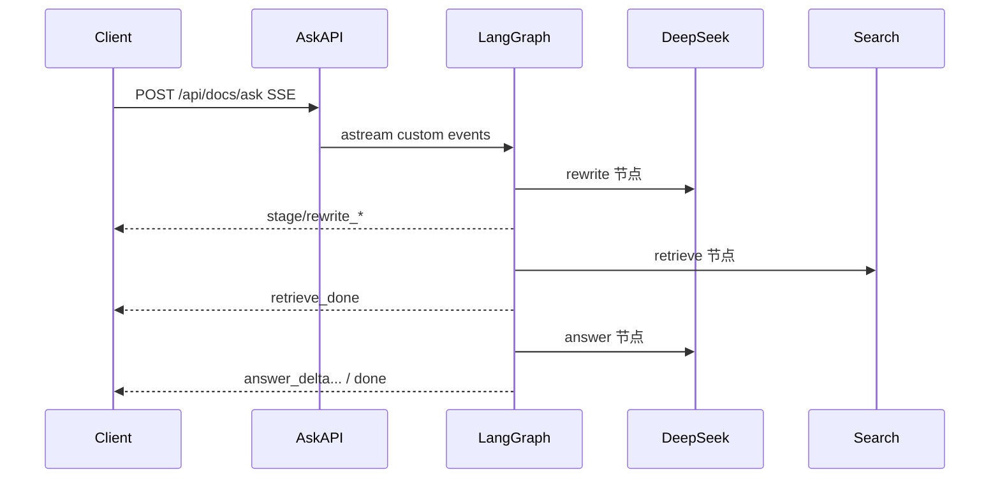
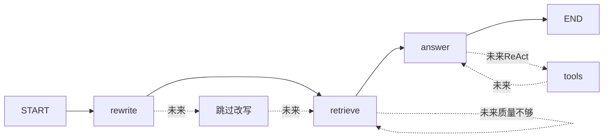

# DeepSeek SSE 问答 + LangGraph 编排技术方案

> 状态：已落地首期实现。  
> 代码位置：编排 `app/rag/ask_graph.py`；LLM `app/llm/`（含 ask 业务 prompt）；SSE 与 `ask_logs` 落库 `app/services/ask.py`；接口 `POST /api/docs/ask`。

## 1. 背景与目标

1. 向量检索前，由大模型精简优化用户问题（rewrite）
2. 向量检索召回相关片段（retrieve）
3. 将命中材料交给大模型润色成自然语言回答（answer）
4. 新接口使用 **SSE**，前端可看清全过程
5. 每次调用落 SQL 审计表，便于追溯
6. 后续可扩展：条件是否改写、二次检索、ReAct

因此编排采用 **LangGraph**，避免长期堆叠手写 if/else。

## 2. 目标链路（首期线性图）



保留现有 `POST /api/docs/search` 纯检索；`/ask` 只做「优化 + 检索 + 润色」。

三步含义：

| 节点 | 作用 |
|------|------|
| `rewrite` | DeepSeek 把原问题改成更利于向量检索的问句 |
| `retrieve` | 用优化后问句调用现有知识库向量检索 |
| `answer` | DeepSeek 基于 hits 生成有依据的回答 |

## 3. 为何选 LangGraph

| 诉求 | LangGraph 怎么接 |
|------|------------------|
| 固定三步流水线 | `StateGraph`：`rewrite → retrieve → answer` |
| 后续「要不要改写」 | 条件边：`should_rewrite` → rewrite 或跳过 |
| 二次检索 | 节点后判断 hits 质量，不满意则 `retrieve` 再入边 |
| ReAct | 增加 `agent` / `tools` 节点与循环边，检索作为 tool |
| SSE 过程可见 | 节点内 `get_stream_writer()` 推 custom 事件，API 层转成 SSE |

首期只实现**线性三节点**；条件边 / 二次检索 / ReAct 仅预留扩展点。

## 4. 图结构



图定义文件：`app/rag/ask_graph.py`。

### AskState（示意）

- `original_query` / `optimized_query`
- `top_k` / `source_path` / `title` / `updated_at`
- `hits` / `total`
- `answer`
- `ok` / `rewrite_fallback` / `error_stage` / `error_message`
- （预留）`rewrite_enabled`、`retrieve_round`、`messages`（ReAct 用）

### 节点职责

1. **rewrite**：调 DeepSeek 流式改写；失败 fallback 原 query，并打 `fallback`
2. **retrieve**：复用 `search_knowledge_base`（线程池）；产出 hits
3. **answer**：基于 hits 流式润色；结束写 `answer_done`

服务层 `app/services/ask.py`：校验 key → `graph.astream(..., stream_mode=["custom","values"])` → 包装成 SSE → 写 `ask_logs`。

## 5. SSE 事件约定

统一 `text/event-stream`，每条 `data` 为 JSON，含 `type`：

| type | 含义 |
|------|------|
| `stage` | `rewrite` / `retrieve` / `answer`，`status: start\|done` |
| `rewrite_delta` / `rewrite_done` | 问题优化增量与结果 |
| `retrieve_done` | `query` / `total` / `hits` |
| `answer_delta` / `answer_done` | 回答增量与全文 |
| `error` | 失败（含 `stage`；改写失败可带 `fallback: true`） |
| `done` | 整次结束（`ok`） |

扩展时**只加新 type，不改旧 type**。

试调示例：

```bash
curl -N -X POST http://localhost:3000/api/docs/ask \
  -H "Authorization: Bearer <token>" \
  -H "Content-Type: application/json" \
  -d '{"query":"职业迷茫和收支规划","top_k":5}'
```

## 6. DeepSeek 接入

官方文档：[DeepSeek API Docs](https://api-docs.deepseek.com/zh-cn/)

### 接入本质

DeepSeek 提供 **OpenAI 兼容** Chat Completions。改 `base_url` + `api_key` + `model`，用 `openai` Python SDK，不必单独接 DeepSeek 专有 SDK。

| 项 | 值 |
|----|-----|
| `base_url` | `https://api.deepseek.com` |
| 鉴权 | `Authorization: Bearer <API_KEY>` |
| 默认模型 | `deepseek-v4-flash`（性价比优先；可换 `deepseek-v4-pro`） |
| 接口 | `POST /chat/completions` |
| 流式 | `stream: true`，读 `choices[0].delta.content` |

### 本地配置（禁止把 Key 写进仓库）

`back/.env`：

```bash
LLM_API_KEY=sk-xxxx
LLM_BASE_URL=https://api.deepseek.com
LLM_MODEL=deepseek-v4-flash
LLM_TIMEOUT_SECONDS=60
```

`.env.example` 仅保留空占位。

### 思考模式

首期：**关闭思考模式**，只流式输出正文，避免 `reasoning_content` 与业务 SSE 混杂。

## 7. LLM 封装（`app/llm/`）

业务节点不直接碰 OpenAI SDK / DeepSeek URL，只依赖本封装；换模型只改 `.env`。

```text
DeepSeekChatClient（app/llm/client.py，全局连接）
├── ensure_configured()
├── _get_client()
└── stream_chat(...)           # 通用流式补全

ask 业务（app/llm/ask_llm.py）
├── format_hits(hits)
├── rewrite_query_stream(llm, original)
└── answer_from_hits_stream(llm, ...)
```

| Settings 字段 | 环境变量 | 默认 |
|---------------|----------|------|
| `llm_api_key` | `LLM_API_KEY` | `""` |
| `llm_base_url` | `LLM_BASE_URL` | `https://api.deepseek.com` |
| `llm_model` | `LLM_MODEL` | `deepseek-v4-flash` |
| `llm_timeout_seconds` | `LLM_TIMEOUT_SECONDS` | `60` |

依赖：`openai` + `langgraph`。不上 `langchain-openai`，避免与自研流式/SSE 抢控制权。

### 与 LangGraph 的边界

| 层 | 做什么 |
|----|--------|
| `llm/client.py` | 全局 DeepSeek 连接与通用 `stream_chat` |
| `llm/ask_llm.py` | ask 业务 prompt：改写 / 润色 |
| `ask_graph.py` | 节点顺序、fallback、custom 事件 |
| `ask.py` + API | 鉴权、跑图、SSE、`ask_logs` 落库 |

## 8. 调用日志落库（`ask_logs`）

每次 `/ask` 成功或异常写入 SQLite 表 `ask_logs`。

| 字段 | 含义 |
|------|------|
| `created_at` | 请求时间 |
| `user_id` | 登录用户 |
| `status` | `success` / `error` |
| `error_stage` / `error_message` | 失败阶段与摘要 |
| `original_query` | 用户原问题 |
| `optimized_query` | 大模型优化后的问题 |
| `rewrite_fallback` | 改写是否回退原问题 |
| `retrieve_total` / `retrieve_hits_json` | 命中条数与 hits 快照 |
| `answer` | 润色后的最终回答 |
| `model` | 如 `deepseek-v4-flash` |
| `duration_ms` | 整次耗时 |

- 写入时机：图跑完或异常收尾时
- SSE 负责实时过程；表负责事后审计
- hits 首期用 JSON 文本；查询列表 API 二期

模型文件：`app/models/ask_log.py`。

## 9. 已拍板决策

- 默认模型：`deepseek-v4-flash`
- 调用日志：落 `ask_logs`
- 编排：线性三节点 `rewrite → retrieve → answer`
- SSE：沿用事件表；扩展只加 type
- 依赖：`langgraph` + `openai` 自封装
- 思考模式：首期关闭
- 图文件：`app/rag/ask_graph.py`

## 10. 后续扩展（首期不做）

1. 条件改写（`need_rewrite` 边路由）
2. 二次检索（质量不够再 retrieve，限制轮次）
3. ReAct（agent + tools；SSE 增加 `tool_call` / `tool_result`）
4. 思考模式透出（`reasoning_delta`）
5. `GET /api/docs/ask-logs` 分页查询

## 11. 范围外（首期）

- 前端页面改动
- 首期透出 DeepSeek 思考链
- 改 `/search` 行为
- 在仓库中保存真实 API Key
