# 从简单对话到可编排 Agent：一条实践路径

> 状态：第 1 章已精简；其余章节为标题占位  
> 面向：后端 / AI 应用开发同学  
> 代码参考：`back` 项目（LangGraph / MCP / RAG / Memory）

---

## 1. 背景与目标

市面上「Agent」一词被用得很滥：客服 Bot、一次 Chat、工作流编排都可能被叫成 Agent，概念反而越来越糊。

这次分享想先把两件事说清楚：

1. **Agent 到底是什么**——不只是会聊天的大模型，而是能围绕目标多步推进：观察状态、决定下一步、必要时调用工具、再根据结果继续，直到给出答案或停止。
2. **它和传统 LLM 有何不同**——传统 LLM 更像一次生成：`输入 → 模型 → 文本`；Agent 在模型之上多了状态、工具，以及「想 → 做 → 再想」的循环。

在此基础上，结合 `back` 项目，按能力阶梯走通一条可落地路径：简易对话 → 短/中长期记忆 → RAG 知识库 → Tools / MCP → ReAct 与图编排，弄清每一层解决什么问题。

---

## 2. 能学到什么

1. 一条由浅入深的 Agent 能力阶梯  
2. 图编排思维：节点、边、条件路由、循环  
3. 怎么给一个简单的智能体，附加上记忆、知识库、工具调用能力  
4. 可落地的工程结构（目录职责怎么切）

---

## 3. 具体内容

### 3.1 简易的 Agent

最简单的 Agent，体验上和网页版 DeepSeek、豆包差不多：用户提问，模型直接回答。差别主要不在「智能程度」，而在 **调用形态**——网页是浏览器里聊；工程里是在服务端用代码调同一类 Chat API（本项目的简易对话也是这个思路）。

对接 DeepSeek 时，常见有两种写法（**都是调 DeepSeek 的模型**，不是改成 OpenAI 公司的模型）：

| | 用 OpenAI SDK 兼容接入 | 原生 HTTP 接入 |
|--|------------------------|----------------|
| 依赖 | `openai` 包 | 无需 `openai`，直接发 HTTP |
| 写法 | 改 `base_url` / `api_key` 后，API 形状和 OpenAI 一样 | 自己拼 `POST /chat/completions` |
| 好处 | 代码短，和生态工具好接 | 不引入 OpenAI SDK，请求完全可控 |

官网文档：https://api-docs.deepseek.com/zh-cn/  
`base_url`：`https://api.deepseek.com`

#### 方式一：OpenAI 兼容（推荐入门）

```python
from openai import OpenAI

client = OpenAI(
    api_key="你的 DeepSeek API Key",
    base_url="https://api.deepseek.com",  # 关键：指向 DeepSeek，不是 api.openai.com
)
resp = client.chat.completions.create(
    model="deepseek-chat",
    messages=[{"role": "user", "content": "你好"}],
)
print(resp.choices[0].message.content)
```

#### 方式二：原生 HTTP（不经过 openai 包）

```python
import os
import requests

resp = requests.post(
    "https://api.deepseek.com/chat/completions",
    headers={
        "Authorization": f"Bearer {os.environ['DEEPSEEK_API_KEY']}",
        "Content-Type": "application/json",
    },
    json={
        "model": "deepseek-chat",
        "messages": [{"role": "user", "content": "你好"}],
    },
    timeout=60,
)
resp.raise_for_status()
print(resp.json()["choices"][0]["message"]["content"])
```

说明：DeepSeek 官方主推「兼容 OpenAI / Anthropic 协议」，没有再单独推一套 DeepSeek 专用 Python SDK；所谓原生，更多是 **直接打官方 HTTP**。工程里为了省事，多数会选方式一。

### 3.1.1 简易对话的局限

> TODO：此处后续补充人工示意图。

到这一步，Agent 其实还只是「能在代码里聊天」：

1. **仍是问答模式**——答案主要来自模型在公网语料上学到的公共知识，对不上真实业务里的私有数据、流程和权限。角色更像 **工作中的百度**：能搜能聊，但不是你们系统里的业务助手。  
2. **没法真正帮你干活**——不能查库、改状态、跑流程、调内部接口；问完就结束，事情还得人自己去做。


---

### 3.2 带短期记忆的 Agent

#### 没有记忆之前：对话是什么形态

未加记忆时，每一轮请求基本是「孤立问答」：模型看不到（或不保留）此前聊过什么。用户回问「我之前跟你讨论过什么」，它只能说没有相关记忆——体验上像每次都在重新认识你。

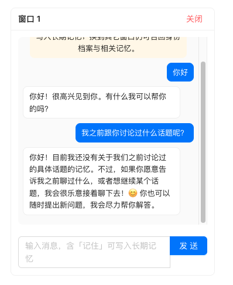

上图说明：即便还在同一个聊天窗口里，系统若没有把历史消息带进下一次调用，模型仍然无法续上前文。

#### 什么是短期记忆

短期记忆 = **同一会话里，模型还能接着刚才的话聊**。  
它不追求「永远记住你是谁」，只保证：**这一轮对话窗口内，上下文不断档**。

可以把它想成微信聊天记录：

- 打开同一个会话窗口 → 还能看到最近几句 → 短期记忆  
- 换一个全新窗口 / 清空记录 → 短期记忆对不上号  

在实现上，本项目用三件事拼出短期记忆：

1. **`thread_id`**：标识「哪一次会话」  
2. **Checkpoint（SQLite）**：把该会话的 `messages` 持久化，刷新页面也能接着聊  
3. **滑动窗口**：真正送给模型时，只截最近约 4 轮（`SHORT_TERM_KEEP = 8` 条 user/assistant），避免上下文无限变长、又贵又慢  


#### 流程图（本项目短期记忆路径）

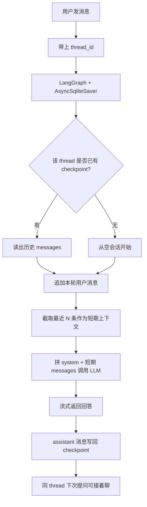

要点就一句：**短期记忆不是模型自己「记住了」，而是系统按会话把最近对话存起来，下次再塞回 Prompt。**

如果用 **LangGraph** 做短期记忆，一般不必自己从零写存取逻辑：给图挂上现成的 **Checkpointer**（如 `AsyncSqliteSaver`），调用时带上 `thread_id`，框架就会按会话自动读写 `messages`。业务侧主要关心「窗口截多长、和中长期记忆怎么分工」。

**结果（有短期记忆后）：** 同一会话里再问「之前聊过什么」，模型能续上前文，而不是声称没有记忆。

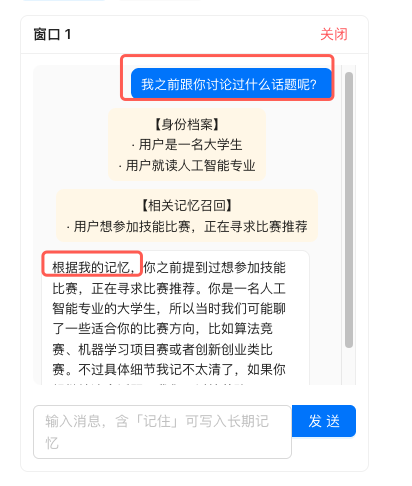

---

### 3.3 带中长期记忆的 Agent

#### 什么是长期记忆

长期记忆 = **跨会话仍能用上的用户信息**。  
短期记忆跟着某个 `thread` 走；长期记忆跟着 **用户** 走——换一个聊天窗口，仍可能记得「你是谁、偏好什么、上次关心什么」。

可以这样对比：

| | 短期记忆 | 长期记忆 |
|--|----------|----------|
| 作用范围 | 当前会话 | 跨会话、跨窗口 |
| 存什么 | 原始对话 messages | 提炼后的事实 / 偏好 |
| 像什么 | 微信当前聊天记录 | 通讯录备注 + 备忘录 |
| 丢掉会话后 | 基本没了 | 还在 |

本项目把长期记忆拆成两类（写入前会先让模型做总结）：

1. **profile（身份档案）**：相对稳定的事实，如职业、专业、身份；存在 **SQLite**，按用户整表合并更新。  
2. **general（一般记忆）**：偏好、目标、约定等可追加事实；写入 **Chroma 向量库**，回答时按当前问题做语义召回。

> 注意：上节截图里若出现「身份档案 / 相关记忆召回」，那已经是长期记忆在起作用；短期记忆主要保证「同会话上下文不断档」。

#### 实现方案（本项目）

**读（每次对话前）**

1. 按 `user_id` 加载 profile（全量注入 system）  
2. 用当前用户问题去 Chroma 检索相关 general  
3. 和短期窗口 messages 一起送给 LLM

**写（每隔若干轮自动总结）**

1. 用户轮次达到阈值（如每 4 轮）  
2. 取近几轮 transcript + 已有 profile  
3. LLM 输出 JSON：`{ profile, general }`  
4. profile 合并写回 SQLite；general 逐条追加进 Chroma  

#### 流程图

分两条线看：**入库（跨会话、周期性提炼）** 和 **提问时召回（每轮都带上）**。

**写：不同会话框里聊，每 4 轮总结入库**

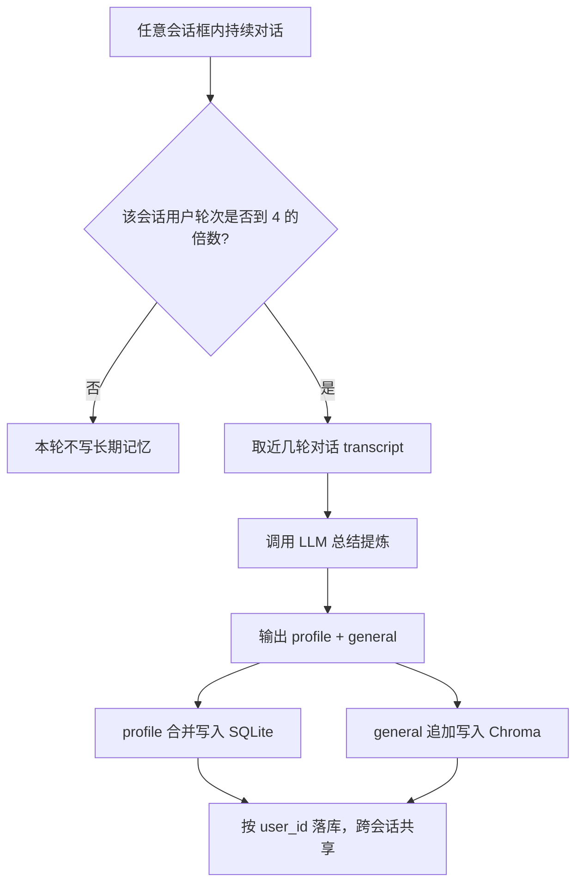

**读：每次提问 = 当前会话 messages + 该用户长期记忆**

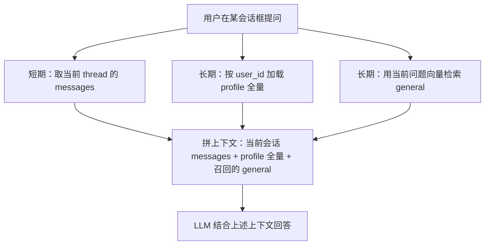

一句话：**长期记忆跟着 user_id 跨会话沉淀；每次提问都带上「当前会话框消息 + 该用户的 profile 全量与 general 检索结果」，而不是只靠当前窗口。**

**效果（跨会话召回）：** 会话 1 里说过想尝试 ACM；换到会话 2 再问「之前想参加什么竞赛」，仍能从身份档案与相关记忆里召回，并据此回答。

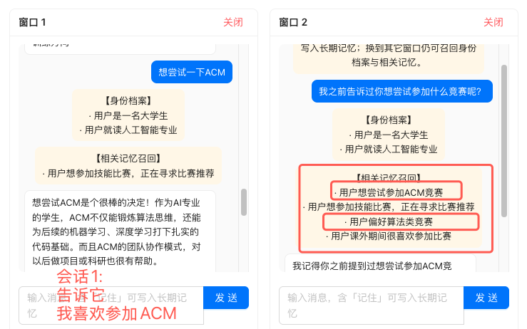

---

### 3.4 带专业知识库的 Agent（RAG）

RAG：回答依据**自有文档**。整条链路：**文档拆分入库 → 混合检索 → 重排 → 生成**。

#### 1. 文档拆分

目标：把长文切成适于检索的 chunk——太碎丢上下文，太大噪声多。

常见切法：

| 方式 | 做法 | 适用 |
|------|------|------|
| 按长度 + 重叠 | 固定 `chunk_size`，相邻块留 `overlap` | 通用长文 |
| 按段落 / 标题 | 先按空行、Markdown 标题切，过长再二次切 | 结构化文档 |
| 按句子边界 | 在句号等处切开，尽量不截断句子 | 中文叙述文 |

本项目大致是：**先按段落合并过短段 → 超长再按长度+重叠切，并尽量落在句子边界**；切完后 Embedding，双路落库（向量库 + 关键字 FTS），并带上路径、标题、下标等元数据。

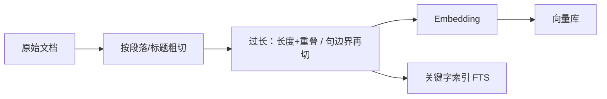

#### 2. 检索：关键字 + 向量 + RRF + Rerank

只用向量易漏专有名词；只用关键字抓不住同义改写。本项目：**两路召回 → RRF 融合 → Rerank 精排**。

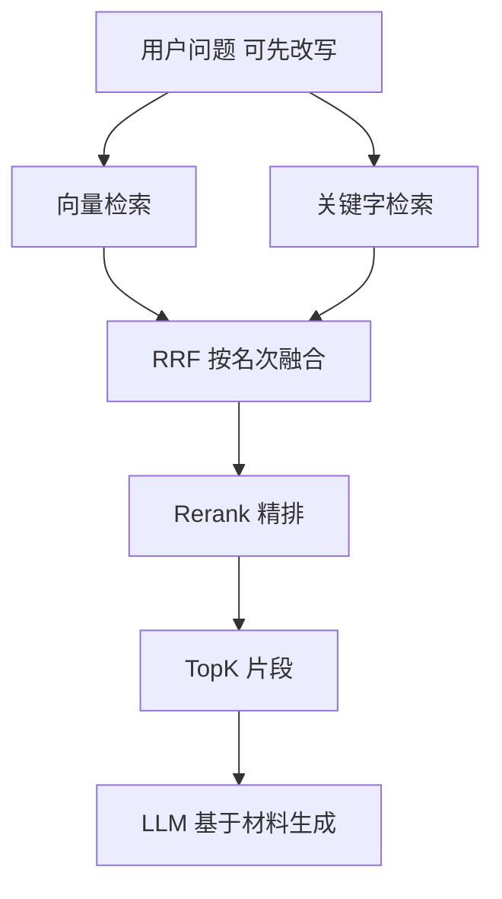

1. **向量检索**：问句 Embedding，按语义近邻召回。  
2. **关键字检索**：FTS / 分词字面命中，适合人名、项目名、报错码。  
3. **RRF 融合**：两套索引分数量纲不同，**不能直接比原始分**；只比各自榜单名次再合成：

\[
\mathrm{RRF}(d)=\sum_{通道}\frac{1}{k+\mathrm{rank}_{通道}(d)}
\]

`rank` 从 1 起，`k` 常取 60。

小例子（`k=60`，各路 Top3）：

| 名次 | 向量 | 关键字 |
|------|------|--------|
| 1 | A（0.92） | C（BM25=12.1） |
| 2 | B（0.81） | A（BM25=8.4） |
| 3 | C（0.70） | D（BM25=5.2） |

- A：\(1/61 + 1/62\) ≈ **0.0328**  
- C：\(1/63 + 1/61\) ≈ **0.0323**  
- B：仅向量第 2 ≈ **0.0161**  
- D：仅关键字第 3 ≈ **0.0159**  

结果约 **A > C > B > D**（两路都靠前的更稳）。同一 `chunk_id` 去重合并。

4. **Rerank**：对「问题 ↔ 候选」再打分，取最终 TopK 再生成。

一句话：混合检索 **召全**，Rerank **排准**。

---

### 3.5 带 Tools 的 Agent

只靠对话时，模型只能「说」；要真正算数、查数、调内部能力，就得把 **Tools** 接进 Agent。本项目拆成两件事：**怎么提供工具**，以及 **工具怎么绑到 LLM 上**（让模型知道有哪些工具、何时该调）。

#### 如何提供 Tools

思路是「能力与编排分离」：工具逻辑先写成普通函数，再挂到常驻 MCP 服务上对外暴露；Agent 作为 Client 去发现，而不是把函数硬编码进图里。

1. **写纯函数**  
   工具本体尽量是普通 Python 函数（入参、返回值清楚，文档字符串写清用途）。例如加减乘一类计算，不依赖 LangChain / HTTP，方便单测和多端复用。

2. **集中注册**  
   新增工具时挂进统一注册表（名字 + 可调用对象）。启动 MCP 服务时遍历注册表，把每个函数登记成可远程调用的 tool。

3. **常驻 MCP 服务对外暴露**  
   用 MCP（本项目是 streamable-http，如 `/mcp`）把工具集跑成常驻进程。好处是：Agent、IDE、其它客户端都能连同一套工具；改工具实现不必改 Agent 图结构，只要服务在、Client 能发现即可。

4. **Agent 侧拉取**  
   构图前，Agent 通过 MCP Client 连上该服务，`get_tools()` 拉回一份 **LangChain 可调用的 tool 列表**（带名称、描述、参数 schema）。后续节点都用这份列表，不必再手写一份「工具目录」。

一句话：**提供 Tools = 函数实现 → 注册 → MCP 常驻暴露 → Client 发现成 tool 列表。**

#### Tools 如何与 LLM 绑定

「提供」只解决「系统里有工具」；「绑定」解决「这一轮模型调用时，模型看得见、会发起调用」。本项目绑在 **agent 决策节点** 上：

1. **`bind_tools`**  
   拿到 tool 列表后，对 Chat 模型做 `llm.bind_tools(tools)`。这一步会把各工具的名称、说明、参数结构塞进本次请求的工具约定里（对 DeepSeek 一类 OpenAI 兼容接口，即 chat completions 的 tools / function calling）。没有绑定，模型只能纯文本回答，不知道可以调 `add` / `multiply`。

2. **模型输出 `tool_calls`，而不是直接当最终答案**  
   绑定后的 runnable 去 `ainvoke` 当前消息。若模型判断需要算一笔账，回复里会带结构化的工具调用（函数名 + 参数），而不是只吐一句自然语言。

---

### 3.6 智能体的 ReAct 运行模式

ReAct（Reason + Act）说的是一种**运行方式**：模型先想要不要动手（Reason），需要时调用工具（Act），看完工具结果再想下一步，如此循环，直到可以直接回答或达到停止条件。

本项目里这条环很直观：`agent` 决策 → 若有 `tool_calls` 就进 `call_tools` 执行 → 再经路由边回到 `agent`；没有工具调用就结束。多步依赖靠多轮「决策 → 执行」串起来，而不是一次把整条流水线写死。

**图结构（ReAct 环）：**

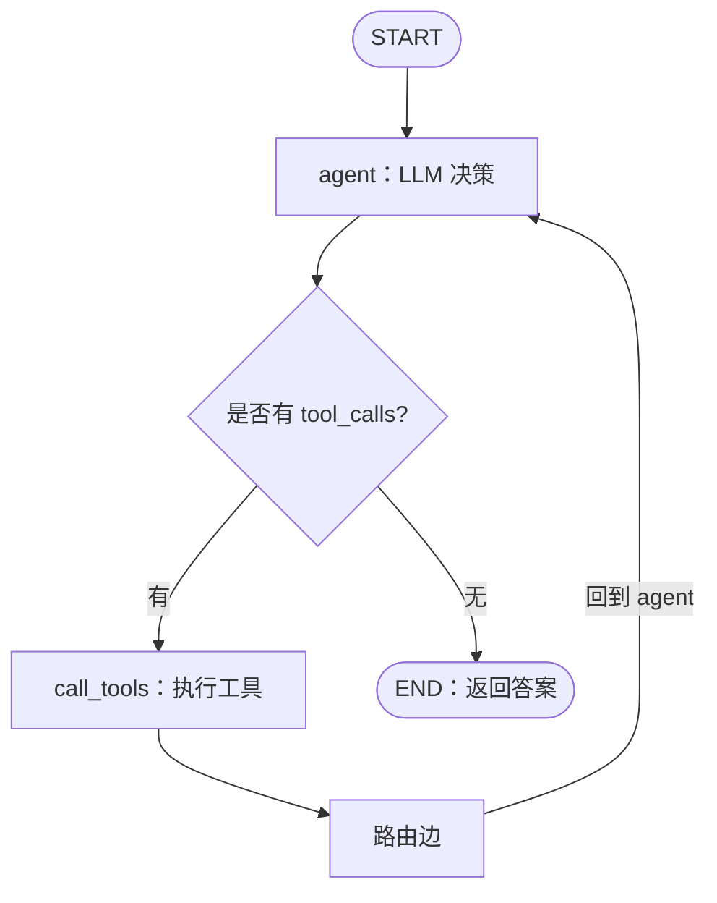

**举例走读：** 现有乘法、加法两个工具。用户问：「我想知道 3×5+1 的答案」（后一步依赖前一步结果）。

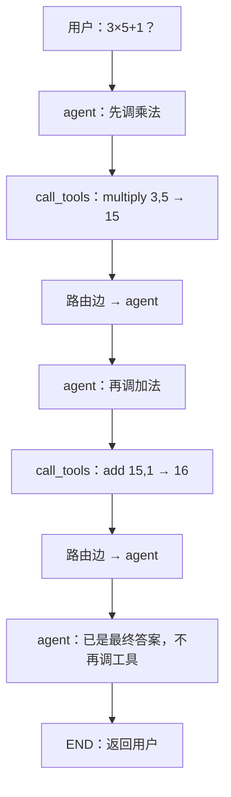


要强调的是：**业界落地 ReAct，一般不是「给某个 LLM 开一个 ReAct 开关」**。模型侧通常只提供对话 + 工具调用协议（function calling）；真正的「想 → 做 → 再想」循环，是工程里用**图编排**（节点、边、条件路由、轮次上限）把流程跑起来的——例如 LangGraph 一类框架。LLM 负责每一步怎么决策；图负责何时调工具、结果怎么回灌、何时停。没有编排层，就只有单次推理，谈不上稳定的 Agent 运行模式。

---

## 4. 编排 Agent

前面本项目的 Agent 图相对精简（`agent ↔ call_tools`）。落地时先把职责拆清：模型连接、工具出口、编排图各管一块，再对照开源实践 [LangGraphChatBot / 04_RagAgent](https://github.com/NanGePlus/LangGraphChatBot/tree/main/04_RagAgent) 看更完整的分诊 + RAG 质检图。

### 本项目相关目录

| 目录 | 职责 |
|------|------|
| `llm/` | LLM 的 `url` / `api_key` / `model` 等基础配置读取，以及公共获取方法（如 `get_llm_client()`）；Ask、评测等业务调用也走这里，不把连接细节散落各处 |
| `mcp/` | Tools 的统一输出口：`tools/` 写纯函数 → `registry` 注册 → `server` 常驻对外暴露；谁要用工具都从 MCP 发现，不在业务里各自挂一份 |
| `agent/` | 可编排 Agent（结构见下）：State / 节点 / 路由 / 构图；经 MCP Client 拉 tools，再绑到 LLM 上做决策 |

配置落在统一 Settings（含 LLM 与 MCP 地址）；`llm/` 管「怎么连模型」，`mcp/` 管「工具从哪出」，`agent/` 管「图怎么跑」。

### Agent 项目架构（参照 `back/app/agent`）

```text
app/agent/
├── __init__.py      # 对外导出 build_agent_graph、load_tools_from_mcp
├── state.py         # AgentState：messages（add_messages）+ 预留 route_hint
├── llm.py           # get_agent_llm()：Agent 专用 Chat 模型（可 bind_tools）
├── mcp_tools.py     # MCP Client：连常驻服务，load_tools_from_mcp() 拉成 tools
├── nodes.py         # agent_node：bind_tools 后决策是否发起 tool_calls
├── routing.py       # route_after_tools：工具执行后的条件路由（可扩展）
└── graph.py         # build_agent_graph：START → agent ⇄ call_tools → END
```

各文件怎么配合：

1. **`state`**：图共享状态，核心是消息列表；后续质检分数、路由提示可加字段。  
2. **`llm` + `mcp_tools`**：构图前准备好 Chat 模型与工具列表。  
3. **`nodes`**：只做推理与发起 `tool_calls`，不在节点里直接执行工具。  
4. **`graph`**：挂 `agent` / `call_tools`，用条件边决定进工具还是结束。  
5. **`routing`**：工具跑完往哪走（当前一律回 `agent` 形成 ReAct；可按工具类型扩成分支）。

关系示意（语雀对 mermaid 支持不稳定，改用文本图）：

```text
Settings（url / key / model / mcp_url）
    │
    ├──────────────────► llm/（公共客户端）
    │
    └──────────────────► agent/llm.py（Chat 模型）
                                    │
mcp/（tools 统一出口）──HTTP 发现──► agent/mcp_tools.py
                                    │
                                    ▼
                            agent/graph.py
                           /      |       \
                          ▼       ▼        ▼
                    nodes.py  call_tools  routing.py
                     （决策）   （执行）   （工具后往哪走）
```

### 对照：更完整的 RagAgent 图

对照开源实践可以看到更完整的 **意图分诊 + 工具调用 + RAG 质检** 图设计：同一套图里既有检索类工具，也有普通计算工具，并用条件边把「要不要重写问题」「要不要直接生成」拆开。

#### 图长什么样

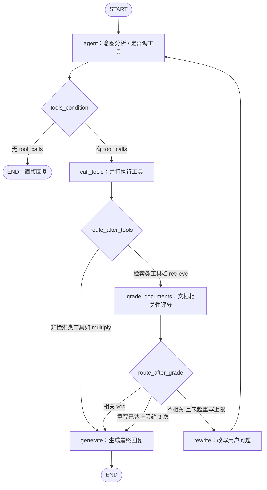


---

## 附录：参考资料

- [NanGePlus / LangGraphChatBot](https://github.com/NanGePlus/LangGraphChatBot)：LangGraph + DeepSeek + FastAPI 实践用例（记忆、RAG、工具调用与动态路由等），可作对照学习  
- [LangGraph 官方文档](https://langchain-ai.github.io/langgraph/)  
- [DeepSeek API 文档](https://api-docs.deepseek.com/zh-cn/)  
- [Model Context Protocol（MCP）](https://modelcontextprotocol.io/)
