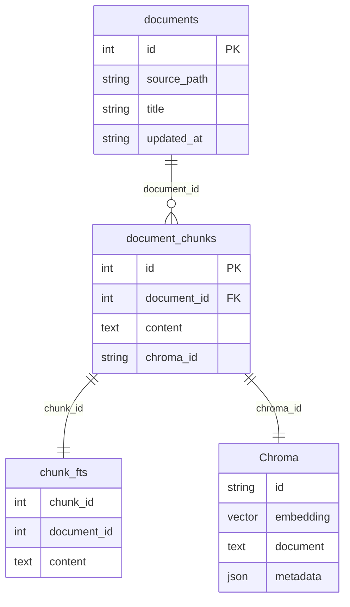

# 混合检索实现原理（知识点整理）

> 项目地址：https://github.com/wanwenxing/all_project_1.git  
> 基于本仓库当前实现：`docs.search_knowledge_base` + Ask 的逐步 `retrieve`。  
> 目标一句话：**向量找语义，关键字找字面，RRF 合粗排，Rerank 出最终少量高质片段。**

---

## 1. 为什么要混合检索

| 单路 | 擅长 | 短板 |
|------|------|------|
| 向量（Chroma + Embedding） | 同义、改写、语义相近 | 专名、人名等字面词不稳定 |
| 关键字（FTS5 + BM25） | 精确词、专名命中 | 同义改写、近义表达偏弱 |

混合：两路各召回一批，再融合与精排，兼顾「找全」和「找准」。

---

## 2. 整体漏斗（本项目默认参数）

```text
用户问题（Ask 时可能先经 rewrite）
        │
        ├─ 向量检索 Chroma          → fetch_k（默认 5）
        └─ 关键字检索 FTS5+BM25     → fetch_k（默认 5）
                    │
              RRF 融合 → candidate_k（默认 5）
                    │
           Reranker 精排 → top_k（默认 2）
                    │
              交给 LLM / 返回 API
```

配置（`app/core/config.py`）：

| 项 | 默认 | 含义 |
|----|------|------|
| `rag_fetch_k` | 5 | 每路粗召回条数 |
| `rag_candidate_k` | 5 | RRF 后候选条数 |
| `rag_default_top_k` | 2 | 最终保留条数 |
| `rag_rrf_k` | 60 | RRF 常数 |
| `rag_hybrid_enabled` | true | 关则只走向量 |
| `rag_rerank_enabled` | true | 关则截断候选，可回退 `rag_min_score` |

约定：`fetch_k ≥ candidate_k ≥ top_k`。

---

## 3. 知识库存储背景

扫描本地 Markdown 日记，按 **文件级**、**正文块级** 落库，支持增量/全量更新；切块后写入向量库（Chroma），供后续混合检索使用。

### 3.1 文件级表（`documents`）

| 字段 | 含义 |
|------|------|
| `source_path` | 本地文件路径 |
| `title` | 文件名 / 标题 |
| `content_hash` | 正文 hash，用于对比新旧、决定是否增量重嵌 |
| `updated_at` | 日记时间（业务时间，可用于过滤） |
| `file_mtime` | 文件修改时间 |


### 3.2 正文块级表（`document_chunks`）

| 字段 | 含义 |
|------|------|
| `document_id` | 关联文件级表 `documents.id` |
| `chunk_index` | 该文内分块序号 |
| `content` | 块正文 |
| `content_hash` | 块正文 hash |
| `char_start` | 块在原文中的起始位置 |
| `char_end` | 块在原文中的结束位置 |
| `chroma_id` | 关联向量库中的向量 id |


向量存储表（`chroma_vectors`）：


### 3.3 关联文章

- https://juejin.cn/post/7667498918424739875
- https://juejin.cn/post/7669975804710600739

---

## 4. 知识点：向量检索

**做什么**：问题 → Embedding → Chroma 近邻查询。

**本项目要点**：

- 向量模型：`BAAI/bge-large-zh-v1.5`（问题与 chunk 都编成向量，再在 Chroma 里做近邻检索）
- 检索结果有两条后续路径：
  1. **不走精排**：按相似度取前若干条，再用最低相似度阈值过滤，低于阈值的直接丢掉
  2. **走精排**：召回结果交给 Reranker（本项目用 `BAAI/bge-reranker-v2-m3`）重新打分排序，不再做相似度阈值粗过滤

代码入口：`search_vector_hits`（`app/services/docs.py`）。

---

## 5. 知识点：关键字检索（FTS5）

**做什么**：字面词匹配 + BM25 排序。

对应的数据库设计：


**为什么用 FTS5**：

SQLite 自带全文检索，零额外服务，本地就能做关键字召回，并自带 BM25 排序，正好补向量检索「字面词对不上」的短板。

**实现原理**（一句话）：先把中文切成词再入库，查询时用同样方式切词去匹配，再按 BM25 排序。

具体分两步：

1. **入库**  
   chunk 正文经 jieba 分词，再补上短专名整词和相邻二字（bigram），拼成「空格分隔的词串」写入 `chunk_fts`。表用 FTS5 + `unicode61`，按空格切词建倒排；`chunk_id` / `document_id` 只做回表用、不参与检索。

2. **查询**  
   用户问题同样分词后，词与词之间用 `OR` 组成 MATCH 表达式；命中行按 BM25 排序（分越低通常越相关），再 `JOIN` 回 `document_chunks` / `documents` 取原文与元数据，并可按路径、标题、时间过滤。MATCH 异常时本路返回空，不影响整次检索。

代码入口：`FTSStore.search` / `search_keyword_hits`。

---

## 6. 知识点：RRF 融合

**RRF（Reciprocal Rank Fusion）**：不比较两路原始分（相似度 vs BM25 量纲不同），只看 **排名**。

公式（本项目）：

```text
rrf(d) = Σ 1 / (k + rank(d))   （对各召回路求和）
```

- `k` 默认 60（`rag_rrf_k`）
- 用 **`chunk_id`** 对齐同一段落
- 两路都出现的 chunk 分数更高（互补命中被抬升）
- 取前 `candidate_k` 条，写入 `rrf_score`

**例子**（`k = 60`）：

| chunk | 向量路排名 | 关键字路排名 | RRF 分数 |
|-------|-----------|-------------|---------|
| A | 第 1 | 第 2 | `1/(60+1) + 1/(60+2) ≈ 0.0328` |
| B | 第 2 | 未命中 | `1/(60+2) ≈ 0.0161` |
| C | 未命中 | 第 1 | `1/(60+1) ≈ 0.0164` |

融合后顺序是 **A → C → B**：A 两路都命中被抬到最前；C 只在关键字路第 1，仍略高于只在向量路第 2 的 B。

关混合时：直接取向量结果前 `candidate_k`。

代码：`rrf_fuse`（`app/rag/hybrid.py`）← `fuse_hits`。

---

## 7. 知识点：Rerank 精排

**做什么**：对候选做 **(query, chunk 正文)** 成对打分，按分重排后截断。

| 对比 | 向量检索 | Rerank |
|------|----------|--------|
| 模型结构 | bi-encoder（问句、文档各自编码） | cross-encoder（问句+文档一起算） |
| 速度 | 快，适合大库粗召回 | 慢，适合小候选精排 |
| 精度 | 粗 | 更高 |

本项目：

- 模型：`BAAI/bge-reranker-v2-m3`（本地 `CrossEncoder`）
- 输出 `rerank_score`，并覆盖对外的 `score`
- 最终只留 `top_k`（默认 2）

核心逻辑（`app/rag/reranker.py`）：

```python
def rerank(self, query: str, hits: list[dict], *, top_k: int) -> list[dict]:
    # 问句 + 每条 chunk 正文组成 pair，交给 cross-encoder 打分
    pairs = [[query, hit.get("content") or ""] for hit in hits]
    raw_scores = self.model.predict(pairs)

    scored = []
    for hit, raw in zip(hits, raw_scores):
        item = dict(hit)
        item["rerank_score"] = float(raw)
        item["score"] = float(raw)  # 对外统一用精排分
        scored.append((float(raw), item))

    scored.sort(key=lambda pair: pair[0], reverse=True)
    return [item for _, item in scored[:top_k]]
```

开关与截断（`rerank_hits`）：开启精排则走上面逻辑；关闭则直接按候选顺序截断到 `top_k`。

```python
def rerank_hits(*, query, candidates, top_k, rerank_enabled=None):
    enabled = settings.rag_rerank_enabled if rerank_enabled is None else rerank_enabled
    if enabled and candidates:
        return get_reranker().rerank(query, candidates, top_k=top_k)
    return candidates[:top_k]
```

---

## 8. 知识点：与 Ask / API 的关系

| 入口 | 行为 |
|------|------|
| `POST /api/docs/search` | 一次跑完漏斗，直接返回最终 hits |
| Ask（LangGraph `retrieve`） | 同漏斗，但逐步 SSE：`vector` → `keyword` → `rrf` → `rerank` → `retrieve_done` |

Ask 结构仍是：**rewrite → retrieve → answer**；混合检索只升级 retrieve 内部。

最终 Top-2 直接约束送给 LLM 的材料量：**少而准，降低噪声与幻觉**。

---

## 9. 知识点：入库与检索的数据一致性

混合检索成立的前提：

1. **Chroma** 有向量 chunk  
2. **SQLite `document_chunks`** 有正文与元数据  
3. **`chunk_fts`** 与 chunk 同步（索引文档时 upsert；删文档时清 FTS）

四者关系：



- **`documents`**：文件级元数据（路径、标题、更新时间等）
- **`document_chunks`**：正文块中枢；一边挂文件，一边用 `chroma_id` / `chunk_id` 对齐向量与 FTS
- **`chunk_fts`**：关键字检索倒排（存分词空格串）；命中后再 JOIN 回 `document_chunks` / `documents` 取原文
- **Chroma**：向量近邻检索；`id = chunk:{chunk_id}`，与 SQL 一一对应

只改库或只重建向量、不同步 FTS，会导致关键字路空/旧。可用 `FTSStore.backfill_from_chunks` 全量重建修复。

---

## 10. 一句话对照表

| 阶段 | 一句话 |
|------|--------|
| 向量 | 语义近邻粗召回 |
| 关键字 | 字面词 + BM25 粗召回 |
| RRF | 按排名融合，解决分数量纲不一 |
| Rerank | 交叉编码精排，提高相关性 |
| Top-2 | 只把最好的少量片段交给下游 |

---

## 11. 关键代码索引

| 模块 | 路径 |
|------|------|
| 编排入口 | `app/services/docs.py`（`search_*` / `fuse_hits` / `rerank_hits` / `search_knowledge_base`） |
| RRF | `app/rag/hybrid.py` |
| 分词 | `app/rag/tokenize.py` |
| FTS | `app/rag/fts_store.py` |
| Rerank | `app/rag/reranker.py` |
| Ask 逐步检索 | `app/rag/ask_graph.py`（`retrieve_node`） |
| 配置 | `app/core/config.py` |
